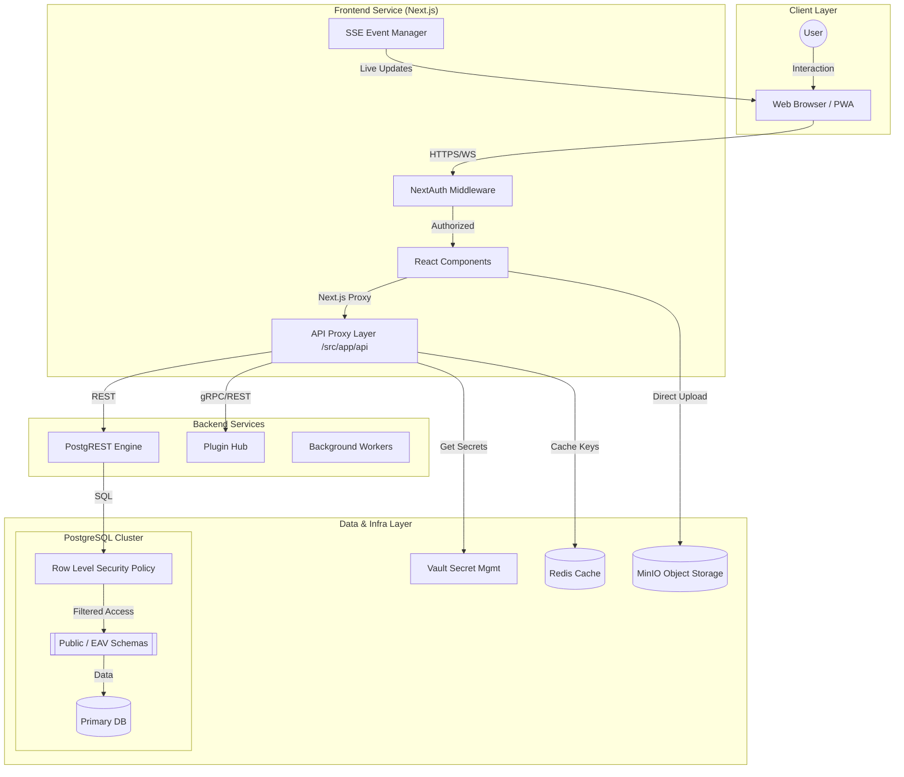
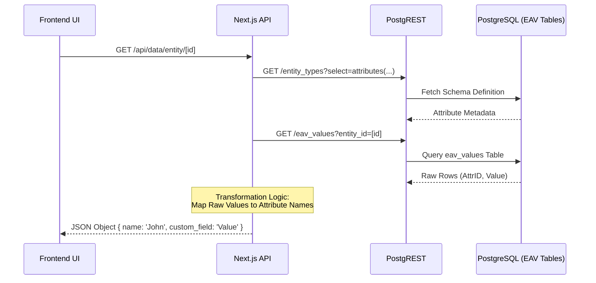
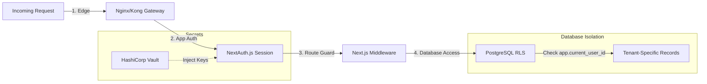

# High-Level Architecture Documentation

## Introduction
The Master Data Management (MDM) System is a unified data platform designed for event organizations. it provides a centralized, flexible environment for managing customer profiles, task assignments, and dynamic data models.

## Technology Stack

### Frontend
- **Framework:** Next.js 14 (App Router)
- **Language:** TypeScript
- **Styling:** Tailwind CSS
- **UI Components:** Radix UI, Lucide React
- **Authentication:** NextAuth.js
- **State Management:** React Context, Hooks

### Backend & API
- **Database:** PostgreSQL
- **ORM:** Prisma
- **API Engine:** PostgREST (Automatic REST API from DB schema)
- **Real-time:** Server-Sent Events (SSE)
- **External API Interaction:** Direct SQL queries and PostgREST fetches

### Storage & Infrastructure
- **File Storage:** MinIO (S3-Compatible)
- **Secrets:** HashiCorp Vault
- **Cache:** Redis
- **Gateway:** Kong API Gateway (Optional/Integrated)
- **Containerization:** Docker & Docker Compose

---

## System Architecture

### Granular System Interaction
The following diagram provides a detailed view of how the various services interact, including internal components like API Proxy and Database RLS.

---

## Data Architecture

### EAV Data Flow
The MDM system uses a dynamic EAV (Entity-Attribute-Value) model. Here is how data is resolved from the flexible schema into a usable object in the UI.

---

## Security & Authorization Flow

The system employs a multi-layered security approach, ensuring data is protected at the edge, the application, and the database level.

### Core Components
1. **MDM App (Next.js):** The main entry point. Handles routing, UI rendering, and server-side logic (SSE, Proxy, Auth).
2. **PostgREST API:** Provides a standardized REST API directly over the PostgreSQL schema, significantly reducing backend boilerplate.
3. **Plugin Hub:** A microservice designed to manage and serve external plugins, allowing for modular extensibility.
4. **PostgreSQL:** The source of truth for all structured data, utilizing Row Level Security (RLS) for data isolation.
5. **MinIO:** Handles binary data storage (attachments, logos, etc.) via S3-compliant protocol.

---

## Data Architecture

### Entity-Attribute-Value (EAV) System
The MDM system implements a flexible **EAV model** to support dynamic data schemas without requiring database migrations for every new field.

- **Entity Types:** Definitions for high-level objects (Customer, Product, etc.).
- **Attributes:** Metadata defining what fields an entity has (Name, Email, Custom Field X).
- **Entities:** Specific instances of an Entity Type.
- **Values:** The actual data stored for a specific entity-attribute pair.

### Prisma Schema
Prisma is used as the primary ORM for internal application logic (especially for complex relations and migrations). It maps directly to the PostgreSQL schema and is used by the Next.js API routes for operations that require multi-table orchestration beyond what PostgREST provides.

---

## Security

1. **Authentication:** Integrated via NextAuth.js with support for OAuth (Google, Azure AD) and traditional credentials.
2. **Authorization:** 
    - **App Level:** Middleware and route-level protection based on session data.
    - **Database Level:** PostgreSQL Row Level Security (RLS) ensures that users can only access data within their assigned "Spaces".
3. **Secret Management:** Sensitive configurations and keys are managed via **HashiCorp Vault** rather than hardcoded environment variables in production.

---

## Performance & Scalability

The MDM system is designed for high-concurrency environments, with a target performance of **1,000+ simultaneous users** as specified in the business requirements.

### Key Scaling Strategies
1.  **Stateless API (PostgREST)**: Unlike traditional monolithic backends, PostgREST is an extremely lean and stateless engine. It can be horizontally scaled across multiple containers to handle massive traffic with minimal overhead.
2.  **Redis Caching**: Frequently accessed metadata (Entity Type definitions, Chatbot configs) are cached in Redis, drastically reducing the load on the primary PostgreSQL database.
3.  **Connection Pooling**: The system uses connection pooling for both direct Prisma connections and PostgREST, ensuring efficient database resource utilization during peak loads.
4.  **Offloaded ChatKit Processing**: For chatbots using the ChatKit engine, the heavy lifting of message streaming and complex UI rendering is partially offloaded to the **OpenAI Infrastructure** (via the ChatKit SDK), reducing the compute burden on the MDM server.
5.  **Rate Limiting**: Integrated Redis-based rate limiting prevents individual users or malicious actors from monopolizing system resources.

---

## Deployment & Orchestration

The application is fully containerized using **Docker**.
- **Local Dev:** Orchestrated via `docker-compose.yml`.
- **Production:** Deployable to **Kubernetes** clusters, leveraging standard CI/CD pipelines (GitLab/GitHub actions).
